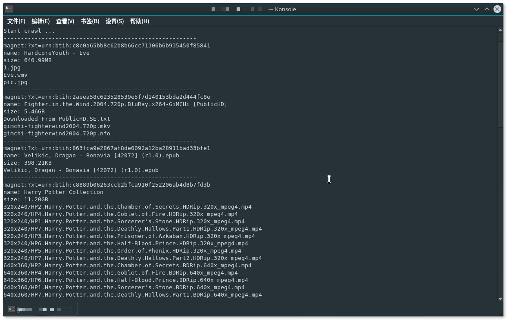

# btlet

通过实现BT协议族中的部分协议来完成一些toolkit

* [DHT-Spider](./README.md#dht-spider)

## Install

```
$ go get -v github.com/neoql/btlet
```

## Dependences

* [willf/bloom](https://github.com/willf/bloom)

## Modules

### DHT-Spider

运行截图



> Example

下面是一个简单的爬虫例子，[这里](./example/btsniffer)是完整的Demo

```go
package main

import (
    "github.com/neoql/btlet"
)

func main() {
    p := btlet.NewSimplePipeline()
    s := btlet.NewSniffer(p)
    go s.Run()
    
    for meta := range p.MetaChan() {
        println(meta)
    }
}
```

## License

MIT, read more [here](./LICENSE).
